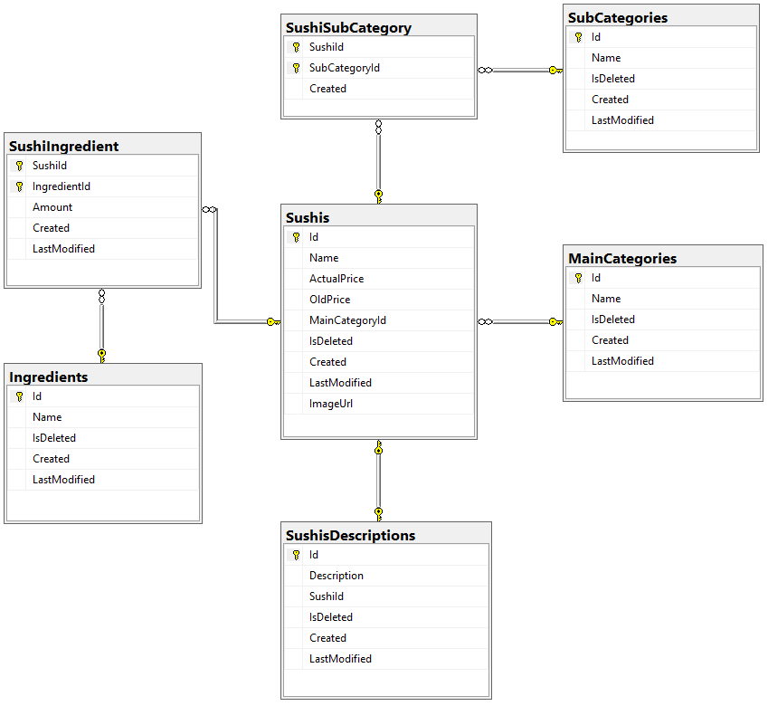

# Suhi Shop Web Page
Web page where you can buy sushi.

## Table of contents
* [Technologies Used](#technologies-used)
* [Features](#features)
* [Screenshots](#screenshots)
* [Project Status](#project-status)
* [Setup](#setup)
* [Licene](#licence)

## Technologies Used
- .NET 8
- Entity Framework Core 8
- Vite 4
- React 18
- Visual Studio 2022
- MS SQL 2019

## Features
- You can browse sushi by categories.
- You can browse sushi by ingredients.
- Each sushi has a subpage with a detailed description.

## Screenshots
>**Database diagram**
>

## Project Status
The project is in progress.

## Setup
_In progress_

## Licence
> [Full content of the licence](LICENSE).

MIT